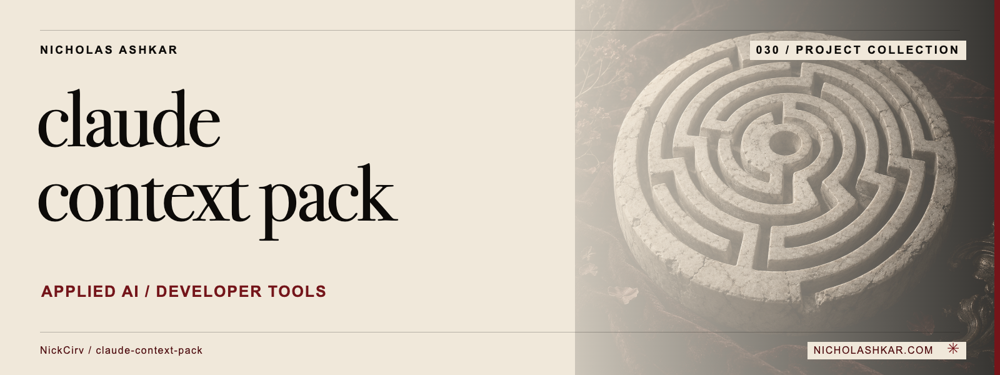

# claude-context-pack

Scans a project for context-heavy files and drafts Claude configuration files from local source structure.


<a id="usage"></a>

<a id="analyse-context-size-and-show-top-bloat-sources"></a>

<a id="preview-recommended-claudeignore-patterns-dry-run"></a>

<a id="write-claudeignore--claudemd-to-project-root"></a>

## What it does

- Scan and suggestions.
- Stack/key-file detection.
- Selective CLAUDE.md and ignore-file generation.


<a id="install"></a>

## Quickstart

Prerequisites: Node.js `>=18.0.0` and npm. The checkout below pins the source used for this documentation.

```sh
git clone https://github.com/NickCirv/claude-context-pack.git
cd claude-context-pack
git checkout de870f12ec6f04769581aed23abeed9cf6a80eee
npm install
node bin/pack.js scan .
```

**Expected behavior (illustrative, not captured):** Prints estimated context size and categorized sources of bloat.

Examples are source-inspected, **not runtime-tested**. See the research record for verification gaps.

## Boundaries and data

Token counts are character-based estimates. Generated CLAUDE.md and .claudeignore files are suggestions that need review; generate writes files and --overwrite replaces existing content.

## Development

The manifest defines `npm test` as:

```sh
node bin/pack.js scan
```

No separate behavioral test file was captured. Tests were not run for this documentation revision.

See [implementation and command reference](docs/REFERENCE.md) for the package scripts and inspected interfaces, and [research record](docs/RESEARCH.md) for the pinned source, document decisions and unresolved checks.

## License and contact

See [LICENSE](LICENSE) for the original terms and attribution. Legal text is unchanged.

[Nicholas Ashkar](https://nicholashkar.com/) · [Discuss a project](https://nicholashkar.com/#oxblood-contact)
